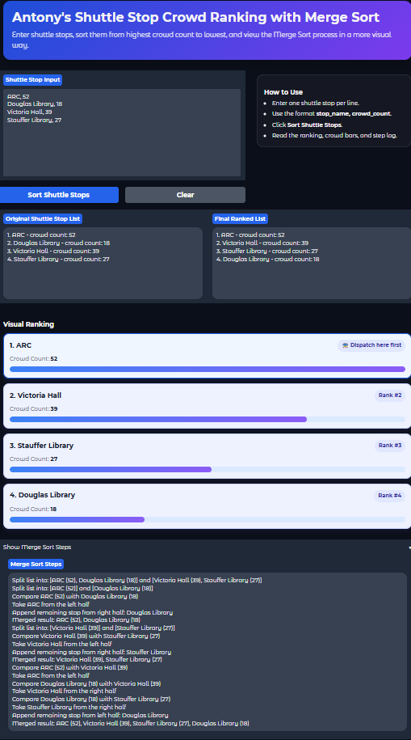
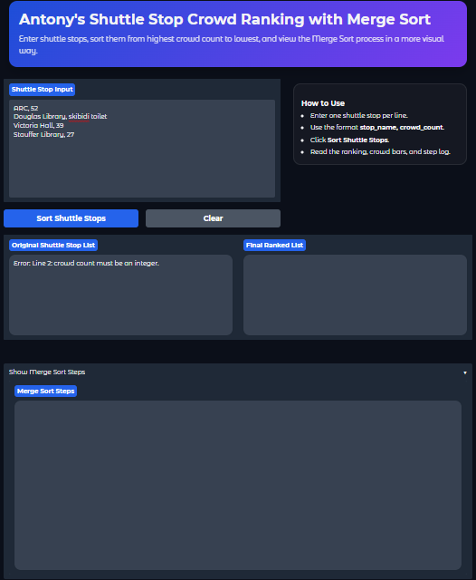
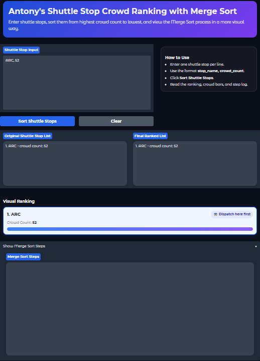
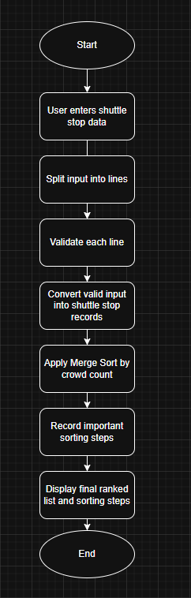

# Shuttle Stop Crowd Ranking with Merge Sort

## Chosen Problem
This project solves the Shuttle Stop Crowd Ranking problem. The app takes a list of campus shuttle stops with crowd estimates and sorts them from highest crowd count to lowest so the busiest stops can be identified first.

## Chosen Algorithm
This project uses Merge Sort. Merge Sort fits this problem because it works well for sorting records by a numeric field such as crowd count, and its divide-and-merge process is easy to show step by step in a visual simulation.

## Demo

### Successful Run

### Invalid Input Example

### Edge Case Example

## Problem Breakdown & Computational Thinking

### Why this algorithm fits
Merge Sort is a good fit because the dataset is a list of shuttle stop records, each with a stop name and crowd count. The algorithm repeatedly splits the list into smaller parts, sorts them, and merges them back together in order by crowd count.

### Assumptions / Preconditions
- Each shuttle stop must have a valid stop name.
- Each crowd count must be a non-negative integer.
- The user input must follow the app’s expected format.
- The app will validate bad input before sorting.

### What the user will see during the simulation
- The original unsorted list of shuttle stops
- The list being split into smaller groups
- Comparisons between crowd counts during merging
- The final sorted ranking from highest crowd count to lowest

### Decomposition
The problem can be broken into these smaller steps:

1. Accept shuttle stop data from the user.
2. Split the input into separate lines.
3. Parse each line into a stop name and a crowd count.
4. Validate the input format and reject incorrect entries with clear error messages.
5. Store the valid data as a list of shuttle stop records.
6. Apply Merge Sort to the list using crowd count as the sorting key.
7. Record the major steps of the algorithm so the user can follow the sorting process.
8. Display the final ranked list from highest crowd count to lowest.

### Pattern Recognition
The main repeating pattern in this problem is comparing crowd counts and arranging records in order. Merge Sort repeatedly splits the list into smaller halves until each part is very small, then repeatedly compares the front items of two sorted halves and merges them back together in descending order of crowd count. The same comparison-and-merge process happens again and again until the whole list is sorted.

### Abstraction
The app will show only the parts of the process that help the user understand the algorithm. It will show the original list, important split/merge stages, comparisons between crowd counts, and the final ranking. It will hide low-level implementation details such as exact index positions, temporary variable handling, and Python recursion mechanics, because those details are not necessary for a beginner to understand how the sorting works.

### Algorithm Design
Input -> The user enters shuttle stop data into the GUI in a simple text format.

Processing -> The app parses and validates the input, converts it into a list of shuttle stop records, applies Merge Sort using crowd count as the sorting key, and records the major sorting steps.

Output -> The app displays the sorted shuttle stop ranking from highest crowd count to lowest and also shows the step-by-step sorting process so the user can follow how the final result was produced.

### Input / Data Structure
The user will enter shuttle stops as text, one stop per line, using the format:

stop_name, crowd_count

For example:

    ARC, 52
    Douglas Library, 18
    Victoria Hall, 39

After validation, the app will store the data as a Python list of records, where each record contains a stop name and a crowd count.

### Flowchart

## Steps to Run

### Local Setup
1. Open the project folder in VS Code or another Python editor.
2. Open a terminal in the project folder.
3. Activate the virtual environment:

        source .venv-x64/Scripts/activate

4. Verify that Gradio is installed:

        python -m pip show gradio

5. Run the app:

        python app.py

6. Open the local Gradio link shown in the terminal if the app does not oppen automatically.
7. Enter shuttle stop data one line at a time in the format:

        stop_name, crowd_count

### Requirements
- Python 3.12
- Gradio

Install dependencies with:

    python -m pip install -r requirements.txt

## Testing

I tested the app with normal inputs, invalid inputs, and edge cases to verify that the sorting logic and input validation both worked correctly.

| Test Case | Input Example | Expected Result | Actual Result |
|---|---|---|---|
| Normal input | Multiple valid shuttle stops with different crowd counts | Stops should be sorted from highest crowd count to lowest | Passed |
| Empty input | Blank textbox | Error message asking for at least one shuttle stop | Passed |
| Invalid number | `Douglas Library, hello` | Error message saying crowd count must be an integer | Passed |
| Missing comma | `ARC 52` | Error message saying the format should be `stop_name, crowd_count` | Passed |
| Negative crowd count | `ARC, -5` | Error message saying crowd count cannot be negative | Passed |
| One shuttle stop | `ARC, 52` | Output should return the same single stop | Passed |
| Duplicate crowd counts | Two or more stops with the same crowd count | All stops should still appear correctly in the final ranking | Passed |

### Notes
- The app correctly rejected invalid input before sorting.
- The Merge Sort algorithm correctly ranked shuttle stops from highest crowd count to lowest.
- The step log showed the split, comparison, and merge process clearly.
- Screenshots of successful and unsuccessful runs are included in the Demo section.

## Hugging Face Link
https://huggingface.co/spaces/flatworshipper/cisc121-shuttle-stop-merge-sort

## Author & AI Acknowledgment
**Author:** Antony Li

**AI Acknowledgment:**  
ChatGPT was used to help brainstorm the project structure, explain how Merge Sort could be applied to the chosen problem, suggest Gradio interface organization, and review README wording. All final code was reviewed, edited, and tested by me. I verified the sorting logic and input validation myself before submission.

**Other Sources:**  
- Gradio documentation
- Course materials and project guidelines